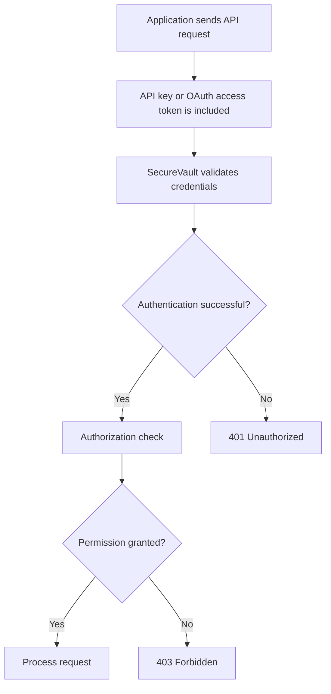

# API Authentication

[← Back to Developer Guide](../index.md)

## Overview
API authentication validates the identity of an application or user requesting access to the SecureVault API. SecureVault validates the provided authentication credentials, such as an OAuth access token or API key, to verify that the request is coming from an authenticated application or user. After successful authentication, SecureVault performs authorization checks to determine what resources and operations the authenticated user is permitted to access based on their assigned roles and permissions.

## OAuth Access Tokens

An OAuth access token is a credential issued to an application or user to access protected resources in SecureVault. The developer's application sends the access token with the API request, typically in the Authorization header, to authenticate the request. SecureVault validates the access token and, if it is valid, processes the request and returns an appropriate API response.

## API Keys
An API key is a credential issued to an application or user to access SecureVault resources. The developer's application includes the API key in the API request to authenticate the request before accessing protected resources. SecureVault validates the API key before processing the request. If the API key is invalid, SecureVault returns a 401 Unauthorized response.

## Authentication Flow
The developer's application sends an API request along with an API key or OAuth access token. SecureVault validates the provided credentials to authenticate the requester. If the credentials are valid, SecureVault performs an authorization check to determine whether the authenticated requester has permission to access the requested resource or perform the requested operation. If the credentials are missing or invalid, SecureVault returns a `401 Unauthorized` response. If the requester is authenticated but does not have permission to access the requested resource or perform the requested operation, SecureVault returns a `403 Forbidden` response.

## Authentication Workflow

## Authentication Error

## 401 Unauthorized

401 Unauthorized is returned when the application does not provide valid authentication credentials, such as when the credentials are missing, invalid, or unacceptable.

## 403 Forbidden

403 Forbidden is returned when the application is authenticated but does not have permission to access a requested resource or perform the requested operation.

## Related Topics

- [API Overview](api-overview.md)
- [Request and Response Format](request-response-format.md)
- [Error Codes](error-codes.md)